June 19th, 2025

## 1. Roadmap
Let's first put together a simple mermaid roadmap to keep my on track with tasks regarding the Knapsack challenge. I want to make sure I stay focused on a single task before moving on, so this is the way to accomplish that.

```mermaid
graph TD
  A[🔧 Figma: Create Variables]
  B[🎨 Figma: Responsive Design]
  C[🧠 Analyze Provided Files, Set Up Theme]
  D[⚛️ Scaffold Components]
  E[🧩 Add TypeScript Types]
  F[🖼️ Build Responsive Layout]
  G[🧵 Add Styling & States]
  H[♿ Add Accessibility]
  I[🧼 Final Cleanup]

  A --> B --> C --> D --> E --> F --> G --> H --> I
```

# Phase 1: FIGMA
---
## 2. Mood board for Design
I went ahead and mood boarded the visual style and UX-centered layout using Pinterest, this is not the normal website I would use for inspiration, but I was able to do it quickly and build a board fast.
Here is the link to that [Pinterest board](https://www.pinterest.com/lair2691/knapsack-code-challenge/)
## 3. Figma Design
Design Checklist:
- [x] List of folders in a grid
- [x] Shows the folder Icon and names
- [x] Supports hover and selection interactions
- [x] Typed with TypeScript !important
- [x] Responsiveness functions well
  
Firstly, I have to bring in the predefined theme from `theme.js`. An easy way to convert this is using AI to build a JSON file that transition all of the JS variables to a Figma-friendly import.
### Analysis
Once I have done that, we need to take a brief look at the data structure for the folder components to determine what all needs to be included in the design. It looks like `Name`, `isPrivate`, `contents`, and `image` (icon?) are the data items that need to be visible to the user.
	1. I noticed that the placeholder URL for `image` is not working, so I am to assume that I will use a [Phosphor Icon](https://phosphoricons.com/) instead.
	2. Potentially add a space for folder color? 

### Limitations
For some of the Figma components, I am unable to do instance swap because I don't have the full version of Figma. I will have to settle with a static Icon and make it swappable for the React component.

I acknowledge that a lot of these things could be components, and work in a more detailed manner, but with limitations and time limit, I am keeping the design relatively brief. Hover states and other things are less important to represent right now, so I am going to focus on the main component most

### Conclusion
The design is done and gives a good idea of layout, and component structure. In a real project I would make sure that the design and React components correspond better, using a mediator like Knapsack or Storybook. However,  since we are jumping into the code anyway, that translation layer needs to happen anyway

Now moving on to React...
   
# Phase 2: REACT
---
I noticed that the typefaces referenced in the `theme.ts` were not included, so I just did a simple `@import` in the `styles.css` file for both Inter, Fira Code, and the fallback monospace, JetBrains.

### Utility-first Styling (Tailwind)
I want to be able to use utility-first styling, so let's add Tailwind. We can use the theme provided and overwrite the default tailwind variables with the new ones.

Tailwind now uses the bundler to load plugins, so we will try switching to Vite from React-Typescript.

Got Vite working and installed tailwind. Had some issues with Vite and ESM imports but we got around it by switching the Vite config to `.mjs` which forces ESM module instead of CJS.

Considered using React-Router but decided it was useless to add considering we aren't routing... (Lol).

I then used AI to map all of the `theme.js` styles into the `tailwind.config.js` via import, so that the values match exactly. If I wanted to use any theme directly later, then its as easy as importing it and referencing the JSON value.

Had a hiccup with it not using the config, since it wasn't using PostCSS. I switched over to PostCSS, using this [install guide](https://v3.tailwindcss.com/docs/installation/using-postcss), and now we are off!

### Folder component
One thing **I learned** while analyzing the Icon component which I have never used before was `Omit<Type, Keys>`. Cool to learn I can extend and create a new type from another and remove a specific property.

I first need to build the folder component, which consists of the properties I spoke of  above. I have a function that simulates an API call but in a real application of non-static data, I would try to fetch errors and communicate more to the user.
### Setting up Screen
I had to create a grid, and I decided to go with the simple auto grid, with auto row and col sizes. I think this fits best with the type of content we are presenting.

I wrote a simple map function that grabs all of the info and adds it to each folder component 

### Accessibility
I want to make sure all of my elements are accessible as per the instructions. I found a good [cheat sheet](https://learntheweb.courses/topics/accessibility-cheat-sheet/) that is full of helpful reminders and pointers.

As I work, I will create classes for each section of the component, but also use utility classes. The custom classes will be purely for accessibility and state styles.
#### Popovers
I didn't have time to do anything other than `titles` for native browser hover text, but I would have implemented [modern popover API](https://developer.mozilla.org/en-US/docs/Web/API/Popover_API).

# Issues
---
1. "More options" on each item is triggering the overall click event.
	1. This is also an issue with accessibility
2. ==Compact mode ==
3. ==Folder animation==
4. ==Overlay==
5. Some elements don't have roles
6. Aria-labels
7. No skeletons or loading states
8. No colors

---

You’ve structured the Knapsack challenge by creating a clear roadmap in Mermaid, focusing on tackling one phase at a time — starting with Figma and progressing to React. In Figma, you established a mood board and design layout for a responsive, UX-friendly grid of folders. You identified the core data elements (`name`, `isPrivate`, `contents`, and `image`), opted for a Phosphor icon due to placeholder limitations, and kept interactions like hover and selection intentionally minimal due to tooling constraints. The design provides a solid foundation for the coding phase, making sure the data structure and layout match closely, with the understanding that in a full project, translation layers like Storybook would help further.

In the React phase, you set up a Vite + Tailwind environment, configured Tailwind to use your `theme.js` values, and built accessible, responsive components for the folder grid. You leveraged TypeScript’s `Omit` for cleaner component typing and created a basic map function to display each item. You added accessibility best practices, referring to a cheat sheet, and acknowledged pending issues like click event collisions, compact mode, animations, and lack of skeleton or color states. Despite these open questions, the core structure and approach are solid, making future enhancements manageable and aligning well with the overall roadmap.